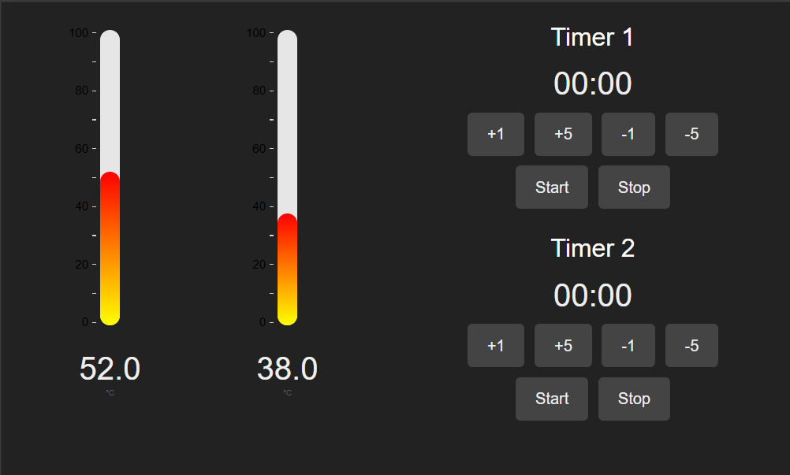

# BrewackerDashboard
## Small little dasboard for brewing

## How to use
### Installation
1. Run ```pip install -r requirements.txt```
2. Install temperatur sensor, e.g. by replacing ```randint()``` function in dashboard.py

### Usage
1. Run ```py dashboard.py```
2. Open http://127.0.0.1:8050/